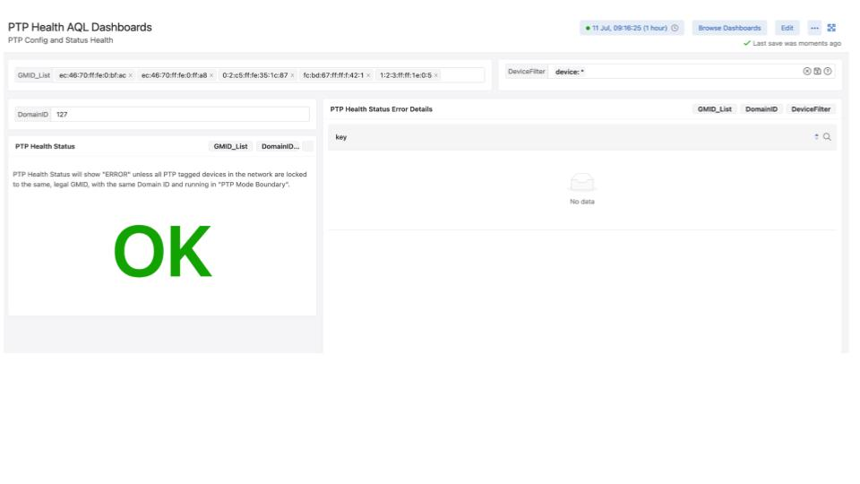
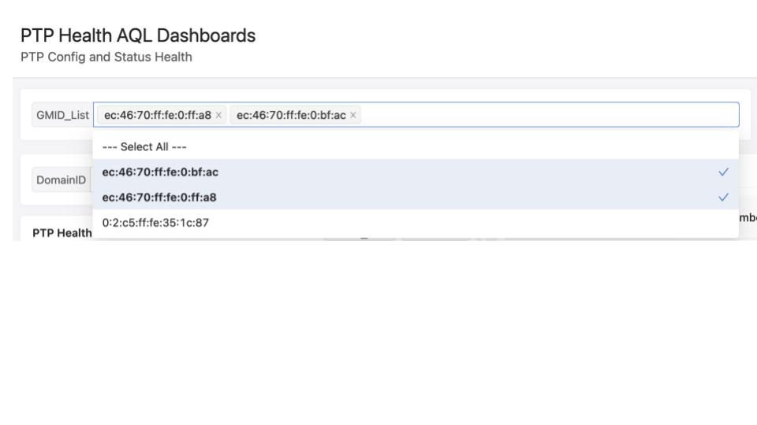
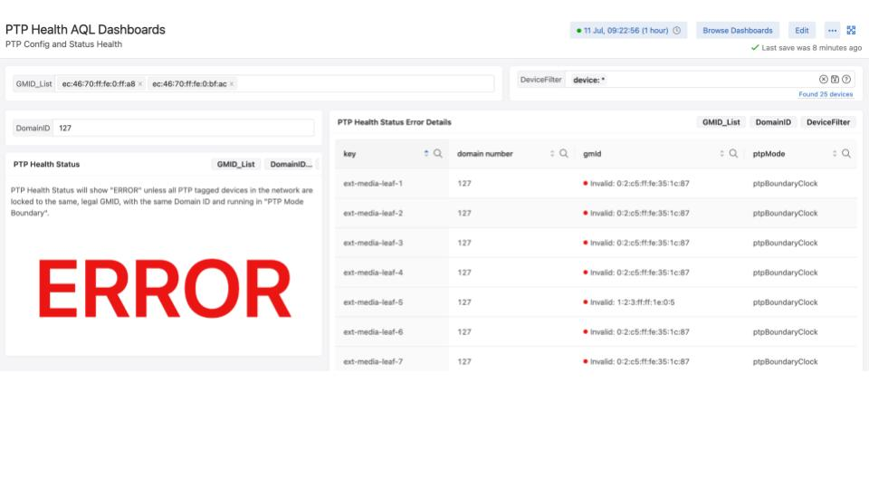
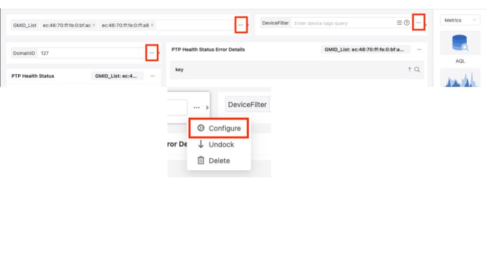
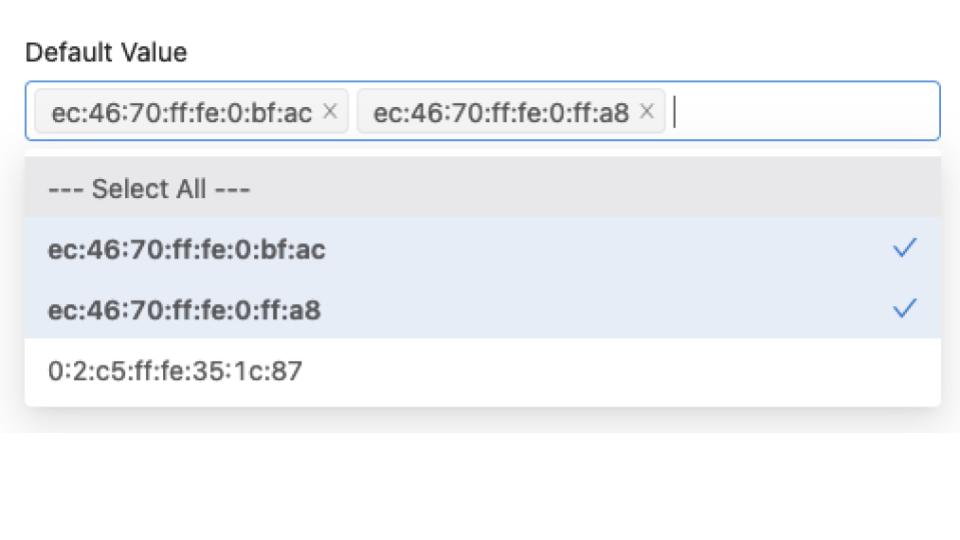
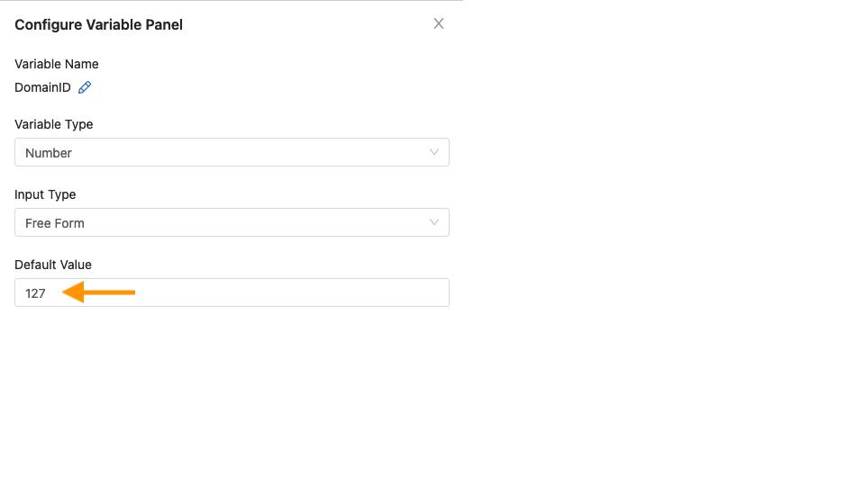
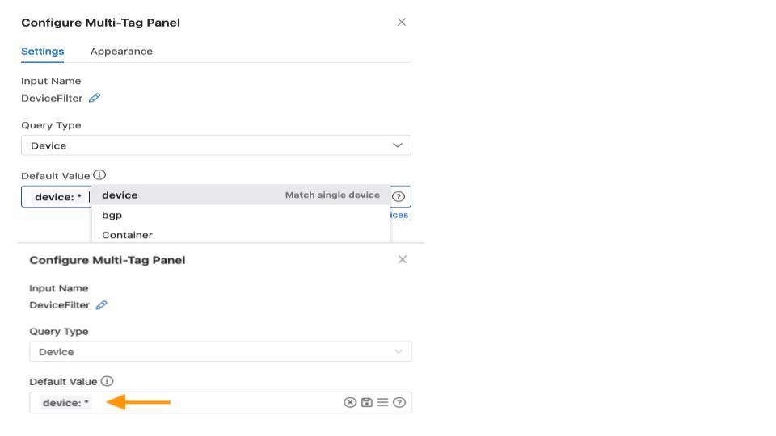

# PTP AQL Dashboard in CloudVision

## Use Case

PTP monitoring is essential in a ST2110 network, however it might be challenging to monitor each switch's PTP status separately. Understanding the multiple configuration states of each switch in the fabric is crucial for reliable timing. With Arista's Cloudvision Portal (CVP), we can take advantage of streaming telemetry from EOS's NetDB to monitor a range of PTP metrics and configuration states. In this article, we'll go over how to create simple dashboards with CloudVision Advanced Query Language (AQL) to monitor PTP in real-time and validate the health of the PTP configuration with a clear Green(OK) or Red(Error) status.

## Using and interpreting the PTP AQL Dashboard

This dashboard will consider three factors before deciding whether to respond with "OK" or "Error." For a specific group of devices, AQL program logic is applied to examine the PTP Domain, PTP configuration mode, and Locked GMID.

 

 We will first choose a set of devices using the "DeviceFilter" input form. This may be based on user-generated tags, system tags, or provisioning containers. On this selected set of devices, logic will be applied. In essence, it's ideal to limit the results to one site where you are confident that every device will be synced to the same GM. One can also create a Container/site specific tags to apply the filter to.

 Second, we will set a numerical value for the PTP domain that applies to our group of devices. SMPTE 2059-2's default value is 127.

 Next, we should choose all GMIDs that apply to the aforementioned group of devices. This is essentially the list of GMs that the devices are permitted to sync with.

In a later section of the document, we will discuss how to change these settings of GMID and DomainID.

 As previously stated, AQL logic will examine three factors before returning a "OK" or "ERROR" status. We will check to see if the devices in the chosen group are all set up with the correct PTP Domain. Additionally, the dashboard will confirm that every device is synchronized to a legitimate GMID chosen from the list and set to the desired "Boundary" mode.

## Modifying defaults

For optimal use of this dashboard, it's crucial to adjust deployment-specific defaults in addition to populating your own GMID/DomainID data.

We must first switch to edit mode in the dashboard. Select "Edit" in the dashboard's top right corner.

In order to modify values and defaults you will need to select the three dots ( … ) to reveal additional options for each panel.

Select "Configure"

We'll start with looking at the GMID List Panel. We must enter the appropriate GMIDs pertinent to your network in the box that has been highlighted in red. Please be careful not to have any leading zeros in the mac address. Only addresses that have had the leading zeros removed will match on the dashboard. For double zero entries, leave a single zero.

 For best results update the values in the "Default Value" selection boxed in orange and select your newly entered GMIDs.

 Next we will update the "Default Value" for both the PTP Domain ID and the Device Filter Panels.

 Same as before, select additional options represented by (…) on the DomainID panel and select configure. Modify the default value to the numerical PTP Domain ID relevant to your network.

 We will do the same thing for the Device Filter panel. The current default is _"device: \*"_ which looks at all devices within CVP in order to perform the logic for verifying PTP. Modify this value to a group of switches you wish to monitor. This can filter based on provisioning containers or user generated tags assigned to each device within CVP.

