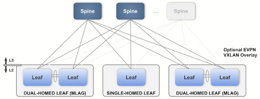

# L3 Leaf-Spine Fabric Studio
## Summary
The L3 Leaf-Spine Studio configures Day 1 deployment of the network, and EVPN Services configures Day 2 operations.

> Note: In its beta-version, this studio does not currently detect/set speed on interfaces, and doesn’t configure recirc channels on platforms that require them for VXLAN routing automatically.

The Studio has been designed to support the following Arista validated L3 leaf-spine design:

> Note: In order to build this design, you’ll first need to use the Inventory and Topology Studio to either accept the LLDP derived topology connections or manually add devices and interface connections.

## Required Tags
You’ll need to have the following device tags in place before you can configure the inputs in this Studio. You can create these tags within the same Workspace by accessing Tags or within the studio's input form.

| Tag | Example | Description |
| ----------- | ----------- | ----------- |
| DC | DC:DC1 | DC defines the data center that is being configured. |
| DC-Pod | DC-Pod:DC1 | Data center pod name. |
| Role | Role:Leaf, Role:Spine, Role:Super-Spine, Role:L2-Leaf | Device Role. Can either be a l3leaf, spine, super-spine, or l2leaf. |
| NodeId | NodeId:1 | This is the node id per node type (l3leaf, spine, super-spine, or l2leaf) per DC-Pod (or per DC in case of super-spine). |
| Leaf-Domain | Leaf-Domain:1 | Specifies the leafs within a common AS, which is usually an MLAG pair of leafs. The value must be an integer. |
| L2-Leaf-Domain | L2-Leaf-Domain:1 | Specifies the l2-leafs connected to same l3 leaf-domain, which is usually an MLAG pair of leafs. The value must be an integer. |
| Super-Spine-Plane | Super-Spine-Plane:1 | Specifies the super-spines that have a common routing config. The value must be an integer. |

  Leaf pairs are assumed to be numbered consecutively starting with an odd number (e.g. the device tagged Leaf-Number:9 and the device tagged Leaf-Number:10 are two devices in an MLAG pair of leafs).  If a leaf is not part of an MLAG pair, just use one number of the odd-even pair and don’t use the other number for another leaf (e.g. the device tagged Leaf-Number:1 will be configured as a standalone leaf if no other device is tagged Leaf-Number:2). |

Tag placement is illustrated in the following diagram:
